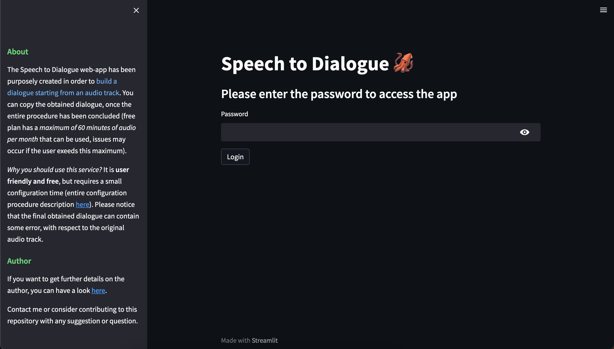
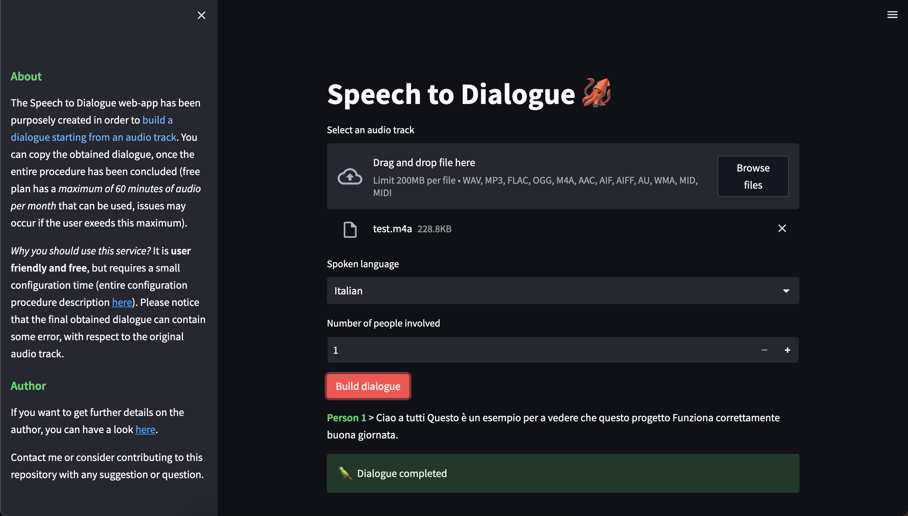

# Speech to Dialogue 🦑


[](https://www.github.com/Amatofrancesco99/Amatofrancesco99)

# About
The Speech to Dialogue (an active open-source mantained streamlit software) has been purposely created in order to **get starting from an audio track the correspondent dialogue transcript**.<br>
You can copy the final obtained dialogue, once the entire procedure has been concluded (free plan has a *maximum of 60 minutes of audio per month* that can be used, issues may occur if the user exeeds this maximum).<br>

Its UI (basic, usable) requires, once logged in, to select: 
- the *audio track file*
- the *spoken language* 
- the *number of people* involved in the dialogue (if set to one, even though more people are actually involved, the app collapses to a ```speech-to-text``` one)

<br>

*Why you should use this software?* It is **user friendly and free**, but requires a small configuration time (entire configuration will be later described).
Please notice that the final obtained dialogue can contain some error, with respect to the original audio track.

# Execution Instructions
## 1 - Setup the Git Repository
If not already done, download and install ```git``` from [git-scm.com](https://git-scm.com/book/en/v2/Getting-Started-Installing-Git). Then clone the repository with the following commands:
```bash
$ cd Temp/GitHub
$ git clone https://github.com/Amatofrancesco99/speech_to_dialogue.git
$ cd speech_to_dialogue
```

## 2. Install required Python libraries
```bash
$ pip install -r requirements.txt
```

## 3. Configure JSON files
Before starting the streamlit application some files need to be properly configured. Be cautios about this section since it is maybe the most important one (**NEVER PUSH THOSE SENSITIVE FILES**).

### 3.1. Passwords
Create a JSON file named `passwords.json` (inside a folder named utils) containing the following element:
```json
{"Admin": "LOG-IN-PASSWORD"}
```
This JSON file is used to store a single key-value pair, where the key is `Admin` while the value is the `LOG-IN-PASSWORD`. This file is used to verify if the entered login password is correct (avoid that external user can access to your application).

### 3.2. CREDENTIALS
Set up the JSON file (inside the folder named utils), named `credentials.json`, that contains the credentials to access to Speech-to-Text Google APIs. You have first to create a [Google Cloud account](https://cloud.google.com/docs/get-started?hl=en) and then following the procedure described [here](https://cloud.google.com/speech-to-text/docs/before-you-begin?hl=en).
At the end your downloaded JSON file should be structured as follows (instead of `XXXXX` you should have proper values):
```json
{
  "type": "XXXXX",
  "project_id": "XXXXX",
  "private_key_id": "XXXXX",
  "private_key": "XXXXX",
  "client_email": "XXXXX",
  "client_id": "XXXXX",
  "auth_uri": "XXXXX",
  "token_uri": "XXXXX",
  "auth_provider_x509_cert_url": "XXXXX",
  "client_x509_cert_url": "XXXXX"
}
```


### 3.3. Counter
Create a JSON file named `counter.json` (inside the folder named utils) containing the following element:
```json
{
    "counter": 0,
    "last_reset": "LAST-RESET-DATE"
}
```
This JSON file is used to keep track of the number of audio minutes have been translated into text in a month (if it is the first time you created this file set the counter as 0 and the last_reset date as today's date - format: YYYY-MM-DD).<br>
This choice is due to the fact that Google provides a Speech-to-Text API that allows developers to convert audio to text programmatically. *Google offers a free tier that includes up to 60 minutes of transcription per month*. However, this **limit may be subject to change over time**, and it's best to check Google's documentation for the most up-to-date information on pricing and usage limits.<br>
Additionally, there may be additional costs associated with using the Speech-to-Text API beyond the free tier, such as fees for additional usage or advanced features.

## 4. Run the streamlit web-app and enjoy
```bash
$ python3 -m streamlit run app.py
```

# TODO
This is a short list of the things that need to be done (fill free to extend this list as you wish).
- Improve [diarization](https://en.wikipedia.org/wiki/Speaker_diarisation) (**PRIORITY 1**)
- Improve README documentation (**PRIORITY 2**)
- Testing: languages different than IT or US/ES; with multiple people; with a very long audio track (**PRIORITY 3**)
- Improve punctuation (**PRIORITY 3**)
- Code cleaning (**PRIORITY 4**)
- Add an example showing the case when more than one people involved in the communication (**PRIORITY 5**)

<br>

| Priority |   Severity    | Emoji |
|----------|--------------|-------|
| Level 1  | Very High    | 👿    |
| Level 2  | High         | 😠    |
| Level 3  | Medium       | 😐    |
| Level 4  | Low          | 🤔    |
| Level 5  | Very Low     | 🥱    |

# Contributions
You are welcome to be an active contributor, adding value to this project either inserting new useful features, improving the UX, fixing bugs or also simply sending me a feedback.

# Example

Illustration of the login page design:



An example of a Speech-to-Dialogue behavior, considering just one person (so is simply speech-to-text), and using Italian as spoken language:

